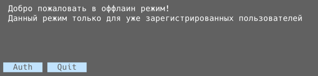

# goph-keeper

Шаги:

1. Сначала требуется запустить сервер

        go run cmd/service/main.go

2. Запускаем клиента

         go run cmd/client/main.go
___
В сервисе клиенте реализованы метода online:

- **Register** - регистрирует клиента через сервис gRPC.
- **Auth** - авторизация клиента через сервис gRPC, получает token и хранит у клиента.
- **Quite** - выходит из клиента.

Offline режим:

- **Auth** - авторизация клиента, который хранится у клиента.

- **Quite** - выходит из клиента.
___
После авторизации открывается возможность сохранять, искать, удалять:

___
1. **Find all data** - выводит все данные в виде таблицы.

___
2. **Creadentials** - хранит данные в виде resource, login, password:

- **Save** - реализован.
- **Deleted** - реализован.
- **Quite** - реализован.
___
3. **Text** - хранит данные в виде text:

- **Save** - реализован.
- **Deleted** - реализован.
- **Quite** - реализован.
___
4. **Binary** - хранит данные в виде binary:

- **Save** - реализован.
- **Deleted** - реализован.
- **Quite** - реализован.
___
5. **Cards** - хранит данные в виде card number:

- **Save** - реализован.
- **Deleted** - реализован.
- **Quite** - реализован.
___
Пример работы sync клиента:

---
**В РАЗРАБОТКЕ:**
- **_Синхронизация со стороны сервера на несколько аккаунтов клиента_**:

Формат реализации: Сервер будет сверять версии у клиентов, если версия у клиента меньше, то сервер собирает все данные по клиенту и
направляет клиенту. Будет создавать дубль базы у клиента. В эту базу будет грузиться последние данные. 
После удаляем у клиента старую базу и переименовываем новую в основную.

- **_Возможность редактирования клиентом своих данных_**
- **_Реализовать таблицу только для хранения уникальных данных_**
- **_Шифрование базы после использования клиентом приложения_**